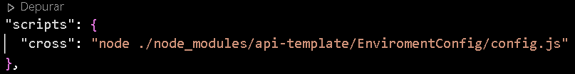

# my-api-framework

<h1>Um template de uma api que eu fiz por diversão</h1>
<h3>Para baixar o projeto:</h3>

    npm i https://github.com/Mauro-Domingues/my-api-framework.git -D
    
<h3>Adicione esse script ao seu package.json:</h3>

    "cross": "node ./node_modules/api-template/EnviromentConfig/config.js"

<h3>Assim como na imagem:</h3>

    
<h3>Para ver os comandos digite:</h3>

    npm run cross

<h3>OBS. Isso é um proeto em fase beta e ainda não está 100% funcional pois o Model do TypeOrm é feito para trabalhar melhor com typescript, em breve uma versão completa baseada em typescrypt será feita e postada oficialmente :)</h3>
